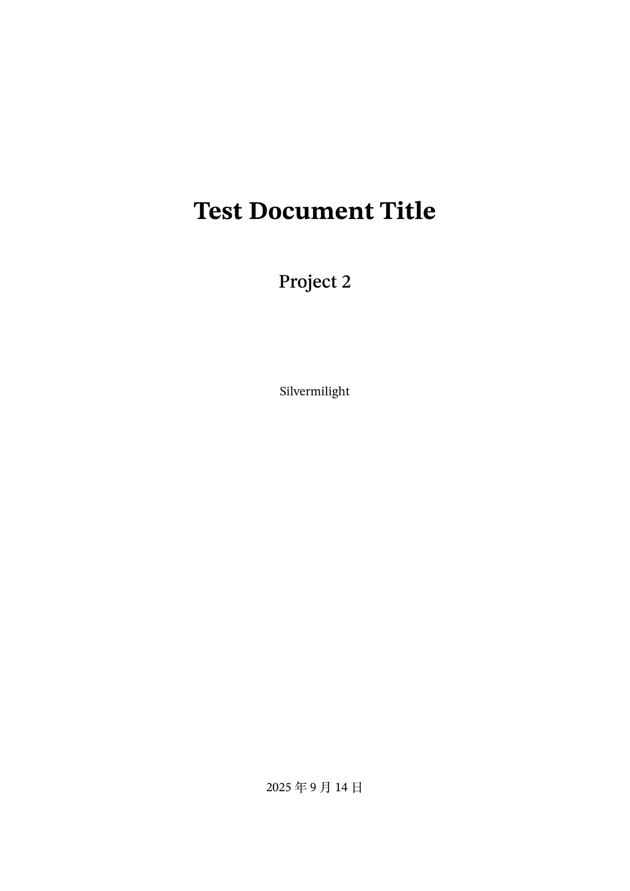
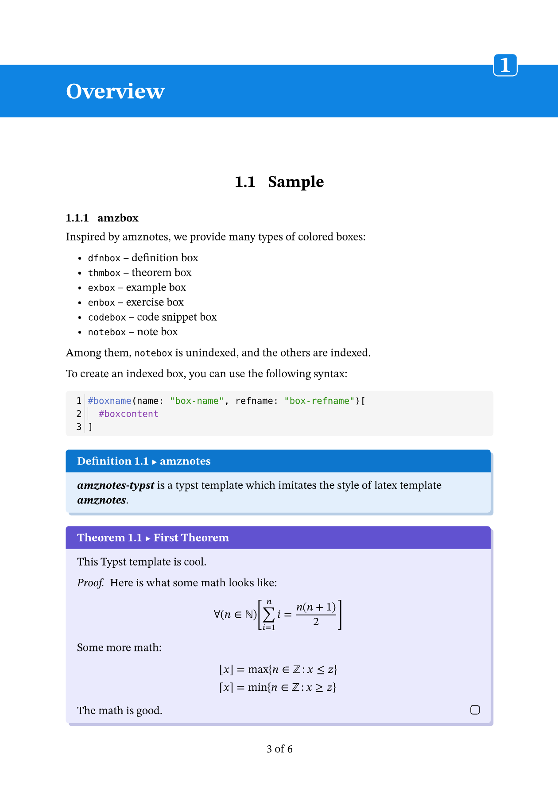
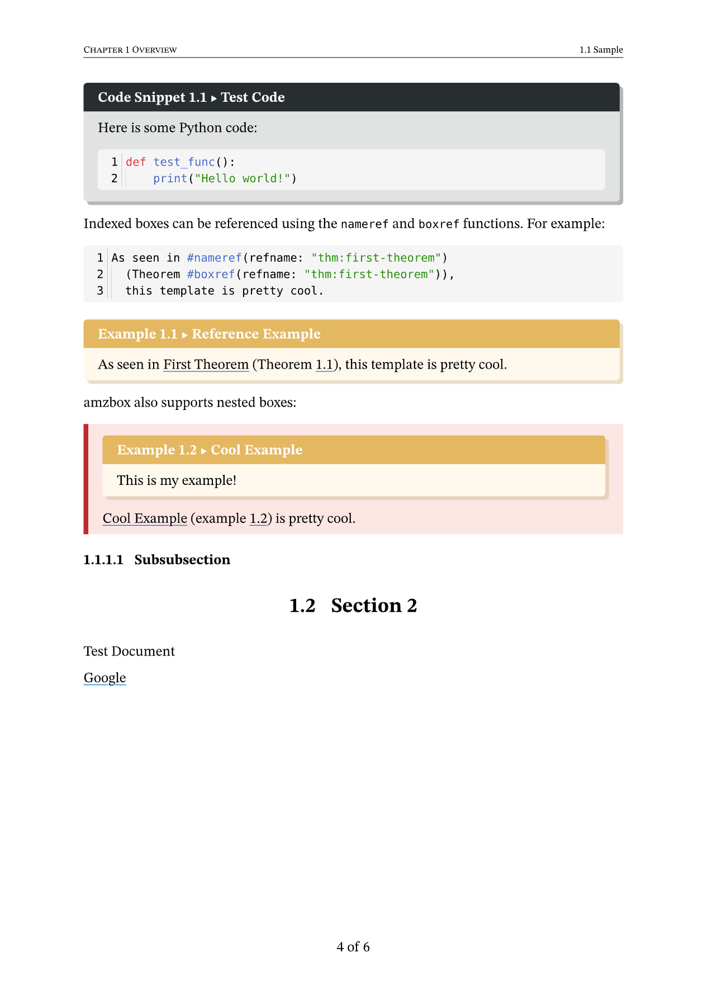

# amznotes-typst

amznotes-typst is a typst template that attempts to achieve the similar style of the pretty latex template [amznotes](https://github.com/alexmingzhang/amznotes). We would not claim that this template is perfect, but it should be a good starting point for those who want to use amznotes but prefer a shorter compile time.

## Sample

<table>
<tr>
<td></td>
<td></td>
<td></td>
</tr>

</table>

## Usage

Clone this repository to your work directory and import the template file `tmplate.typ` into your document.

```typst
#import "amznotes-typst/template.typ"
```

You may need to install the fonts below, which are used in the template:

- STIX Two Text
- STIX Two Math

## Develop Plan

- [x] Add shadow for amzbox
- [x] Support code block
- [x] Add page header and footer
- [x] Add `#nameref` and `#boxref` support
- [x] Support nested amzbox
- [ ] Support automatic pagebreak for amzbox

## License

This template is released under the MIT license.
